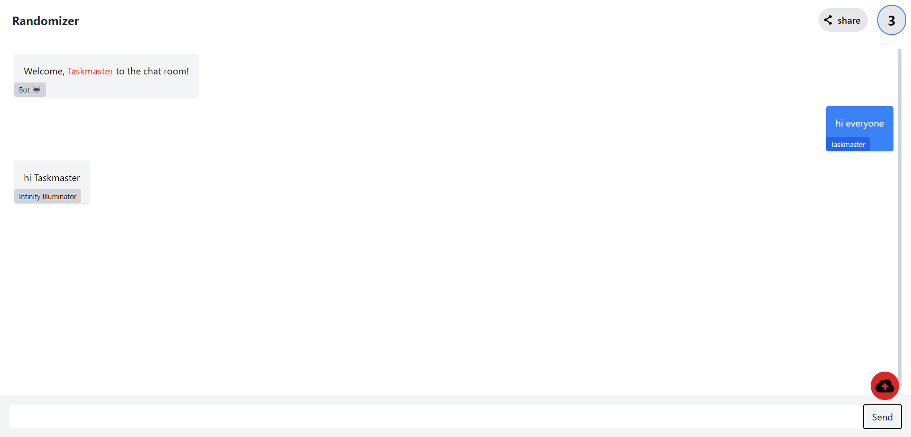
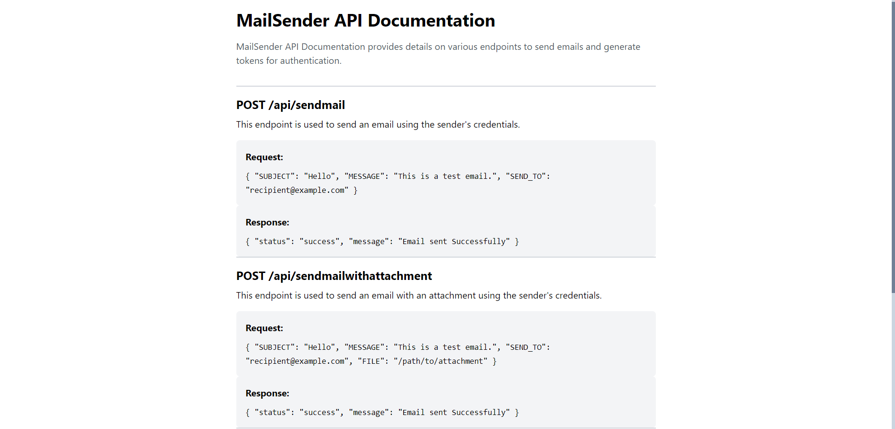

# Randomizer

## About

Randomizer is a privacy-focused web application that allows users to send messages without the need for login, ensuring seamless communication while prioritizing user privacy. Additionally, Randomizer provides free APIs, such as sending emails, enhancing its functionality and user experience.

## Tech Stack

- **Frontend:** React.js (Vite)
- **Backend:** Node.js

## Preview

### Homepage


<!-- Describe the homepage and its key features. -->

### Chat Page



<!-- Include a brief description of the chat page, highlighting its functionalities. -->

### Public APIs



<!-- Provide details about the APIs or any relevant architecture diagram. -->

## Getting Started

1. **Clone the repository:**
   ```bash
   git clone https://github.com/sharma39vishal/Randomizer
   ```

2. **Install dependencies:**
   ```bash
   npm install
   cd client
   npm install
   ```

3. **Run the application:**
   ```bash
   # Run Frontend
   cd client
   npm run dev

   # Run Backend
   npm start
   ```

   Access the application at `http://localhost:5000` in your browser.

